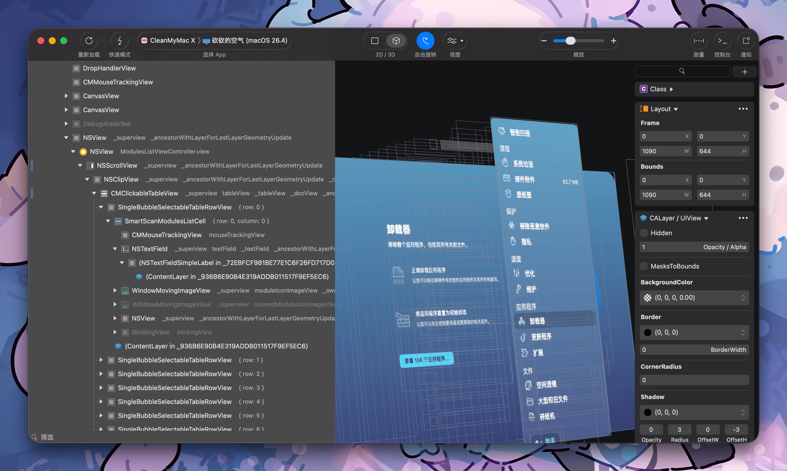

# LookInside

LookInside is a macOS UI inspector for debuggable macOS and iOS apps.



This repository packages:

- the macOS app in [`LookInside/`](LookInside/), [`LookInside.xcodeproj`](LookInside.xcodeproj), and [`LookInside.xcworkspace`](LookInside.xcworkspace)
- shared inspection libraries in [`Sources/`](Sources/)
- the `lookinside` command-line tool in [`Sources/LookInsideCLI`](Sources/LookInsideCLI)

LookInside is a community continuation of Lookin. The public product name in this repository is `LookInside`, while compatibility module names such as `LookinServer`, `LookinShared`, and `LookinCore` are intentionally preserved to reduce migration friction for existing integrations.

The project is intended to ship without telemetry, crash upload, or automatic update services.

## What It Does

LookInside can:

- discover inspectable macOS targets, iOS Simulator apps, and USB-connected devices
- inspect target metadata from a desktop app or the CLI
- fetch live view hierarchies
- export hierarchy archives for later analysis

## Build

### Requirements

- macOS
- Xcode and command line tools
- a debuggable macOS or iOS app running locally, in Simulator, or on a connected device if you want to inspect something live

### Build the CLI

```bash
swift build
swift build -c debug --product lookinside
```

### Build the macOS app

```bash
bash Scripts/sync-derived-source.sh
xcodebuild -project LookInside.xcodeproj -scheme LookInside -configuration Debug -derivedDataPath /tmp/LookInsideDerivedData CODE_SIGNING_ALLOWED=NO build
```

The sync step refreshes the app's mirrored shared sources from [`Sources/`](Sources/) into [`LookInside/DerivedSource`](LookInside/DerivedSource).

### Local Release

To run a signed local release build, bump the app version, notarize it, push the release tag, and publish a GitHub Release from your machine:

```bash
bash Scripts/build-and-release.sh
```

By default the script increments the app target's patch version and build number. You can override the version explicitly with `--version x.y.z`.

## CLI Quick Start

Run `swift run lookinside ...` from the repository root. If you run it from `~` or another directory, SwiftPM will fail with `Could not find Package.swift`.

```bash
cd /path/to/LookInside
swift build -c debug --product lookinside
.build/debug/lookinside list --format json
```

The built binary is the most direct way to use the CLI during local development:

```bash
.build/debug/lookinside list
.build/debug/lookinside inspect --target <id>
.build/debug/lookinside hierarchy --target <id>
.build/debug/lookinside export --target <id> --output ~/Desktop/sample.lookinside
```

## Commands

- `lookinside list [--format text|json] [--transport mac|simulator|usb] [--bundle-id <id>] [--name-contains <text>] [--ids-only]`
- `lookinside inspect --target <id> [--format text|json]`
- `lookinside hierarchy --target <id> [--format tree|json] [--output <path>]`
- `lookinside export --target <id> --output <path> [--format auto|json|archive]`

## Common Argument Patterns

List only macOS targets as JSON:

```bash
.build/debug/lookinside list --format json --transport mac
```

List only simulator target IDs for piping into other tools:

```bash
.build/debug/lookinside list --transport simulator --ids-only
```

Filter by app name substring:

```bash
.build/debug/lookinside list --format json --name-contains Mini
```

Fetch a hierarchy as JSON instead of a text tree:

```bash
.build/debug/lookinside hierarchy --target <id> --format json
```

Write a hierarchy tree to disk:

```bash
.build/debug/lookinside hierarchy --target <id> --output /tmp/sample-tree.txt
```

Export the same hierarchy payload as JSON:

```bash
.build/debug/lookinside export --target <id> --output /tmp/sample.json --format json
```

Export a LookInside archive:

```bash
.build/debug/lookinside export --target <id> --output /tmp/sample.lookinside
```

`export --format auto` infers the format from the extension. JSON exports must use `.json`. Archive exports must use `.archive`, `.lookin`, or `.lookinside`.

## Example Output Shapes

`targetID` values are opaque identifiers discovered at runtime. In practice they look like `mac:47170:1774294178` or `simulator:47164:1774294178`.

Example `list --format json` output:

```json
[
  {
    "appInfoIdentifier": 1774294178,
    "appName": "MiniTerm",
    "bundleIdentifier": "wiki.qaq.MiniTerm",
    "deviceDescription": "iPhone Air",
    "osDescription": "26.3.1",
    "port": 47164,
    "serverReadableVersion": "1.2.8",
    "serverVersion": 0,
    "targetID": "simulator:47164:1774294178",
    "transport": "simulator"
  }
]
```

Example mac target output:

```json
[
  {
    "appInfoIdentifier": 7268387651031256382,
    "appName": "lookinside-mac-swift-host",
    "bundleIdentifier": "",
    "deviceDescription": "Managed's Virtual Machine",
    "osDescription": "macOS 26.2.0",
    "port": 47170,
    "serverReadableVersion": "1.2.8",
    "serverVersion": 7,
    "targetID": "mac:47170:7268387651031256382",
    "transport": "mac"
  }
]
```

Example `inspect --format json` output:

```json
{
  "connectionState": "connected",
  "protocolVersion": 7,
  "target": {
    "appInfoIdentifier": 1774294178,
    "appName": "MiniTerm",
    "bundleIdentifier": "wiki.qaq.MiniTerm",
    "deviceDescription": "iPhone Air",
    "osDescription": "26.3.1",
    "port": 47164,
    "serverReadableVersion": "1.2.8",
    "serverVersion": 0,
    "targetID": "simulator:47164:1774294178",
    "transport": "simulator"
  }
}
```

Example `hierarchy` tree output:

```text
- UIWindow#2 [keyWindow] frame={0, 0, 420, 912}
  - UITransitionView#11 frame={0, 0, 420, 912}
    - _UIMultiLayer#12 frame={0, 0, 420, 912}
      - UIDropShadowView#14 frame={0, 0, 420, 912}
        - UILayoutContainerView#16 frame={0, 0, 420, 912}
          - UITransitionView#21 frame={0, 0, 420, 912}
            - UIViewControllerWrapperView#23 frame={0, 0, 420, 912}
              - UILayoutContainerView#25 frame={0, 0, 420, 912}
                - UINavigationTransitionView#30 frame={0, 0, 420, 912}
                  - UIViewControllerWrapperView#32 frame={0, 0, 420, 912}
                    - UIView#34 frame={0, 0, 420, 912}
                      - UICollectionView#37 frame={0, 0, 420, 912}
                        - _UITouchPassthroughView#54 frame={0, -234, 420, 912}
                        - _UITouchPassthroughView#56 frame={0, -234, 420, 912}
                          - UIKit.ScrollEdgeEffectView#58 alpha=0.00 frame={0, 0, 420, 176.80}
                          - UIKit.ScrollEdgeEffectView#81 alpha=0.00 frame={0, 764.20, 420, 147.80}
                        - _UIScrollViewScrollIndicator#104 alpha=0.00 frame={414, 486, 3, 106}
```

Example `hierarchy --format json` shape:

```json
{
  "app": {
    "appName": "MiniTerm",
    "bundleIdentifier": "wiki.qaq.MiniTerm",
    "deviceDescription": "iPhone Air",
    "deviceType": "0",
    "osDescription": "26.3.1",
    "osMainVersion": 26,
    "screenWidth": 420,
    "screenHeight": 912,
    "screenScale": 3,
    "serverReadableVersion": "1.2.8",
    "serverVersion": 0,
    "swiftEnabledInLookinServer": -1
  },
  "collapsedClassList": [],
  "colorAlias": {},
  "displayItems": [
    {
      "className": "UIWindow",
      "memoryAddress": "0x1045098b0",
      "oid": 2,
      "frame": { "x": 0, "y": 0, "width": 420, "height": 912 },
      "bounds": { "x": 0, "y": 0, "width": 420, "height": 912 },
      "alpha": 1,
      "isHidden": false,
      "representedAsKeyWindow": true,
      "customDisplayTitle": "",
      "children": [
        {
          "className": "UITransitionView",
          "oid": 11,
          "children": []
        }
      ]
    }
  ],
  "serverVersion": 7
}
```

The JSON hierarchy is recursive. Each item includes geometry (`frame`, `bounds`), visibility (`alpha`, `isHidden`), identity (`className`, `memoryAddress`, `oid`), and nested `children`.

## Validation Hosts

SwiftPM builds two embedded macOS validation hosts for local end-to-end checks:

```bash
swift build -c debug --product lookinside-mac-swift-host
swift build -c debug --product lookinside-mac-objc-host
```

Run them from the repository root:

```bash
.build/debug/lookinside-mac-swift-host
.build/debug/lookinside-mac-objc-host
```

## Codex Skill

This repository also ships a Codex skill for the CLI and host integration workflow at [`skills/lookinside-cli`](skills/lookinside-cli).

Install it into your local Codex skills directory:

```bash
mkdir -p "${CODEX_HOME:-$HOME/.codex}/skills"
ln -s "$PWD/skills/lookinside-cli" "${CODEX_HOME:-$HOME/.codex}/skills/lookinside-cli"
```

If the symlink already exists, replace it with:

```bash
ln -sfn "$PWD/skills/lookinside-cli" "${CODEX_HOME:-$HOME/.codex}/skills/lookinside-cli"
```

Then invoke it in Codex with a prompt such as:

```text
Use $lookinside-cli to inspect a running app, capture a hierarchy, or export a LookInside archive.
```

The skill includes a concise workflow guide, integration notes for embedding or packaging `LookinServer`, and output-shape reference material for `list`, `inspect`, `hierarchy`, and `export`.

## Project Notes

- `ReactiveObjC` is vendored under [`LookInside/ReactiveObjC`](LookInside/ReactiveObjC)
- `Peertalk` is vendored under [`Sources/LookinCore/Peertalk`](Sources/LookinCore/Peertalk) with preserved MIT notice in [`Resources/Licenses/Peertalk.txt`](Resources/Licenses/Peertalk.txt)
- `ShortCocoa` is vendored under [`LookInside/ShortCocoa`](LookInside/ShortCocoa) and distributed here on the same GPL-3.0 basis as upstream Lookin; see [`Resources/Licenses/ShortCocoa.md`](Resources/Licenses/ShortCocoa.md)
- canonical shared runtime code lives in [`Sources/LookinCore`](Sources/LookinCore) and [`Sources/LookinServerBase`](Sources/LookinServerBase)
- the macOS app builds mirrored copies from [`LookInside/DerivedSource`](LookInside/DerivedSource), so shared-source changes should be made in [`Sources/`](Sources/) and then synced

## License

This repository is distributed under GPL-3.0. See [`LICENSE`](LICENSE) and preserved third-party notices in [`Resources/Licenses/`](Resources/Licenses/).

Notable bundled components:

- `ReactiveObjC`: MIT, see [`Resources/Licenses/ReactiveObjC.md`](Resources/Licenses/ReactiveObjC.md)
- `Peertalk`: MIT, see [`Resources/Licenses/Peertalk.txt`](Resources/Licenses/Peertalk.txt)
- `LookinServer`: MIT, see [`Resources/Licenses/LookinServer.txt`](Resources/Licenses/LookinServer.txt)
- `ShortCocoa`: distributed in this repository on the same GPL-3.0 basis as upstream Lookin, see [`Resources/Licenses/ShortCocoa.md`](Resources/Licenses/ShortCocoa.md)
- `Lookin` upstream client code: GPL-3.0, see [`Resources/Licenses/LookinClient.txt`](Resources/Licenses/LookinClient.txt)

## Acknowledgements

LookInside is derived from upstream Lookin work and keeps compatibility with that ecosystem where practical.

Primary upstream references:

- `CocoaUIInspector/Lookin`
- `QMUI/LookinServer`
